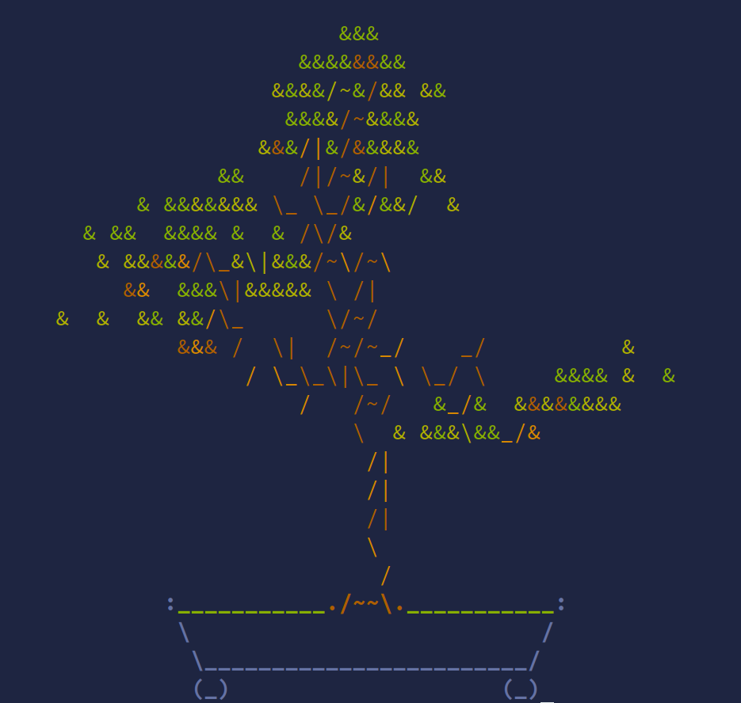

# Bonsafi

Bonsafi is a simple POSIX shell script inspired by the "Forest" app.

It basically runs a lofi hiphop radio in the background and displays bonsai.sh animation. You'll get notification with your progress every time you grow a tree

## Dependencies
Required 
- `mpv`
- `curl` or bonsai script

Optional:
- `cbonsai`
- `bonsai.sh`
## Usage

```
$ bonsa-fi -h
Usage: bonsa-fi [OPTIONS]

bonsa-fi is a simple POSIX script to help you concentrate

optional args:
    -l STR      Specify source of the music that will play in the background
    -q          Quiet mode. Disables notifications
    -c          Curl mode. Script will pull bonsai.sh from the internet
    -h          Show help
```
## Installation
Copy the `bonsa-fi` file to `/usr/bin/`
```
$ git clone https://github.com/sioodmy/bonsa-fi
Cloning into 'bonsa-fi'...
remote: Enumerating objects: 11, done.
remote: Counting objects: 100% (11/11), done.
remote: Compressing objects: 100% (9/9), done.
remote: Total 11 (delta 2), reused 10 (delta 1), pack-reused 0
Receiving objects: 100% (11/11), 46.14 KiB | 1.28 MiB/s, done.
Resolving deltas: 100% (2/2), done.
$ cd bonsa-fi
$ cp bonsa-fi /usr/bin/
```

